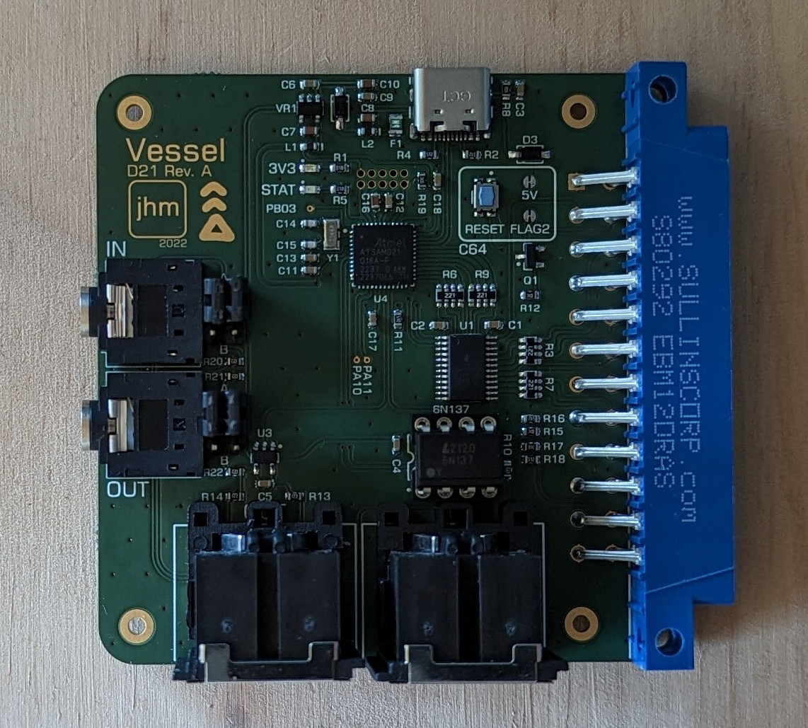

Vessel
======

Vessel is a high performance MIDI interface for the C64 based on an
Arduino Due-like platform, optimized to reduce interrupt load on the
C64.  Vessel is only compatible with software written specially for it
as it has its own protocol (see below).

Vessel's main points of differences from other C64 MIDI interfaces are:

* it uses the user port, not the cartridge port
* it does not use/need any CIA shift register ports
* it can transfer multiple bytes per transaction (unlike ACIA/6850 designs)

If you are interested in acquiring a Vessel please contact josh@vandervecken.com.

Theory of operation
-------------------

The Vessel interface provides a buffered, 31250bps MIDI I/O
implementation via the C64's user port, without requiring the
C64 to handle an interupt (though the C64 can choose to receive
one - see below).

The C64 provides a shift-register based TTL compatible serial port,
implemented on a CIA 6526/8520, via the user port. This is
inconvenient and slow as software must work with one bit at a time.

Fortunately the user port also provides an (unbuffered) TTL 8 bit I/O
interface to the same CIA chip. The CIA can both generate a signal for
external hardware that the C64 has written a value to that port, and
allows the external hardware to trigger an NMI (Vessel uses this to tell
the C64 there is at least one byte read to read). 

The Vessel interface uses this 8 bit I/O port (PB0-7), /PC2, PA2, and /FLAG. 
The C64 always controls the direction - whether it wants to read
from Vessel or write. Vessel will buffer incoming MIDI data until the
C64 wants to read the buffer, and will also write out from the buffer
any data that the C64 has written. The C64 can read and write to
Vessel faster than MIDI's datarate, so the C64 must not exceed MIDI
bandwidth.

When PA2 is high, the C64 wishes to transmit. /PC2 will go low for one
C64 cycle, after the C64 has written a byte. We catch the rising edge
of that low pulse and read PB0-7, and buffer the byte to be transmitted
over the MIDI port.

When PA2 is low, the C64 wishes to receive. Vessel writes the number
of bytes it will transmit to the C64 (queued until now from the MIDI
port) to PB0-7.  Then for each /PC2 low pulse (signifying the C64 has
read the port), we will send another byte (if we have any buffered,
from the MIDI port).

The C64 has no way to know that Vessel has successfully read or
written a byte, we simply have to keep up with its schedule. An
Arduino Uno isn't fast enough, but a Due is (with time for other tasks
while PA2 changes state input/output.

C64 to Vessel commands
----------------------

The C64 can send Vessel a command, by sending byte 0xFD (not used by MIDI),
and then a command, and then a fixed number of data bytes (depending on the
command - unless otherwise specified, a command is followed by 0 data bytes).

By default, NMI on external input is off, all MIDI channels are masked (only
channel-less messages will be sent to the C64), and MIDI through is disabled.

* 0x00 HH LL CN: Config: channel mask high byte (HH), low byte (LL), and config byte (CN). Config byte bit 0 enables NMI, bit 1 enables MIDI through.
* 0x01: Reset. Vessel will reset to default config,
* 0x02: Version. Vessel will return a version string (currently ASCII "vessel0").

Upgrading firmware
------------------

The Arduino IDE can be used to reflash Vessel via the onboard USB-C port.
You should select the right port in the Tools menu before uploading.

NOTE: you will need to add the following to to WInterrupts.c:

    void PIOC_Handler (void) __attribute__ ((weak));

On Linux this can be located with the following command.

    josh@vek-x:~$ find .arduino15 -name WInterrupts.c
    .arduino15/packages/arduino/hardware/sam/1.6.12/cores/arduino/WInterrupts.c

If you will upgrade the IDE you will have to change this file again.

References
----------

C64 Programmers Reference Guide, Appendix M, 6526 Functional Description

https://archive.org/details/c64-programmer-ref/page/n449
