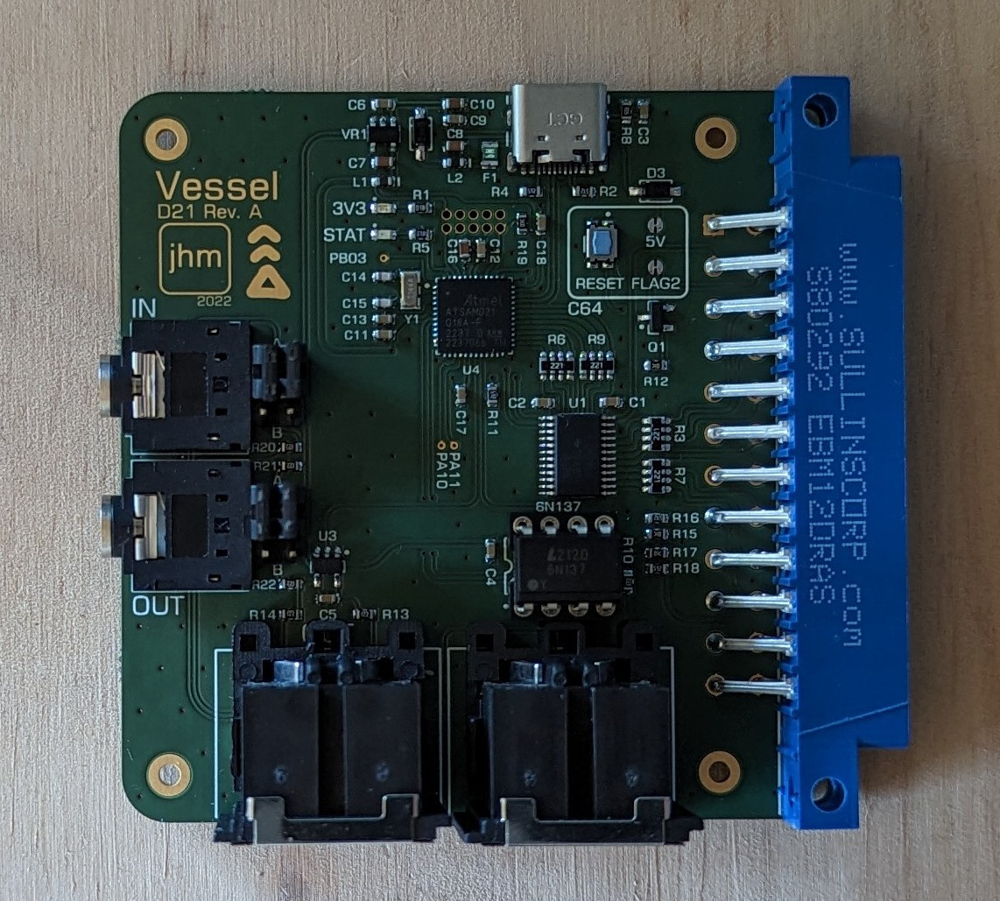

Vessel
======

Vessel is a high performance MIDI interface for the C64 based on an
Arduino SAM/D/3X-like platform, optimized to reduce interrupt load on the
C64.

Vessel's main points of differences from other C64 MIDI interfaces are:

* it uses the user port, not the cartridge port
* it does not use/need any CIA shift register ports
* it can generate an NMI on MIDI clock (allowing an application to be precisely synchronized)
* it can transfer multiple bytes per transaction (unlike ACIA/6850 designs)
* the C64 can configure Vessel to filter MIDI messages to save CPU time

If you are interested in acquiring a Vessel please contact josh@vandervecken.com.

Supported applications
----------------------

Vessel is only compatible with software written specially for it
as it has its own protocol. Currently known applications are:

| Application | What it is | Vessel functionality used |
| --- | --- | --- |
| [SID Wizard 1.97](https://github.com/anarkiwi/sid-wizard/releases) / [M64 SID Wizard](https://github.com/M64GitHub/sid-wizard-vessel) | Native C64 music tracker with live-performance MIDI sync | Receives external MIDI clock to sync playback to external gear. The anarkiwi fork (now based on SID Wizard 1.97) polls MIDI each frame; the M64 fork uses Vessel's NMI-on-MIDI-clock for tighter sync |
| [defMONV](https://github.com/anarkiwi/defmonv/releases) | Patched defMON C64 music tracker that acts as a MIDI clock master | Sends MIDI clock ($F8), start ($FA) and stop ($FC) over Vessel to sync external gear, replacing defMON's ScannerBoy sync |
| [Station64 V2.6](https://csdb.dk/release/?id=207214) | C64 MIDI tracker/performance station | MIDI input and output |
| [Vessel ASID Player](https://github.com/anarkiwi/vap/releases) | Turns the C64's SID(s) into a remote ASID synthesis device | Receives MIDI SysEx (ASID protocol) to write SID registers; supports dual SID |
| [Vicficken](https://github.com/anarkiwi/vvf/releases) | MIDI-controlled port of the Vicficken synth | Receives MIDI to drive all synth parameters (replacing joystick/paddle/keyboard) |
| [Vessel MIDI Player](https://github.com/anarkiwi/vmp/releases) | Turns the C64's SID(s) into a multi-voice MIDI synth | Receives notes, pitchbend and CC across channels; relies on Vessel's large buffers, CIA parallel transfer and MIDI message filtering |
| [Vesselmon](https://github.com/anarkiwi/vessel) | Reference test/monitor program in the Vessel repository | Configures Vessel and exercises raw MIDI send/receive (including loopback) and device detection |

Theory of operation
-------------------

The Vessel interface provides a buffered, 31250bps MIDI I/O
implementation via the C64's user port, without requiring the
C64 to handle an interupt (though the C64 can choose to receive
one - see below).

The C64 provides a shift-register based TTL compatible serial port,
implemented on a CIA 6526/8520, via the user port. This is
inconvenient and slow as software must work with one bit at a time.

Fortunately the user port also provides an (unbuffered) TTL 8 bit I/O
interface to the same CIA chip. The CIA can both generate a signal for
external hardware that the C64 has written a value to that port, and
allows the external hardware to trigger an NMI (Vessel uses this to tell
the C64 there is at least one byte read to read). 

The Vessel interface uses this 8 bit I/O port (PB0-7), /PC2, PA2, and /FLAG. 
The C64 always controls the direction - whether it wants to read
from Vessel or write. Vessel will buffer incoming MIDI data until the
C64 wants to read the buffer, and will also write out from the buffer
any data that the C64 has written. The C64 can read and write to
Vessel faster than MIDI's datarate, so the C64 must not exceed MIDI
bandwidth.

When PA2 is high, the C64 wishes to transmit. /PC2 will go low for one
C64 cycle, after the C64 has written a byte. We catch the rising edge
of that low pulse and read PB0-7, and buffer the byte to be transmitted
over the MIDI port.

When PA2 is low, the C64 wishes to receive. Vessel writes the number
of bytes it will transmit to the C64 (queued until now from the MIDI
port) to PB0-7.  Then for each /PC2 low pulse (signifying the C64 has
read the port), we will send another byte (if we have any buffered,
from the MIDI port).

The C64 has no way to know that Vessel has successfully read or
written a byte, we simply have to keep up with its schedule. An
Arduino Uno isn't fast enough, but a Due is (with time for other tasks
while PA2 changes state input/output).

Vessel API
----------

The C64-side protocol — configuration, sending and receiving MIDI, and the full
set of C64-to-Vessel commands — is documented in [docs/API.md](docs/API.md).
Complete, runnable example programs (assembled in CI) are in
[examples/](examples).

Upgrading firmware (SAMD21 hardware)
------------------------------------

The Arduino IDE can be used to reflash Vessel via the onboard USB-C port.
You should select the right port in the Tools menu before uploading
(Vessel will show as an Arduino Zero, native port). You will also need
the "MIDI Library" (by Francois Best) installed, and the "USB-MIDI" library,
via Tools/Manage Libraries.

Upgrading firmware (old SAM3X)
------------------------------

The Arduino IDE can be used to reflash Vessel via the onboard USB-C port.
You should select the right port in the Tools menu before uploading
(Vessel will show as an Arduino Due, native port). You will also need
the "MIDI Library" (by Francois Best) installed, and the "USB-MIDI" library,
via Tools/Manage Libraries, and support for SAM boards installed (Tools/Board Manager).

NOTE: you will need to add the following to to WInterrupts.c:

    void PIOC_Handler (void) __attribute__ ((weak));

On Linux, WInterrupts.c can be located with:

    $ find .arduino15/ -name WInterrupts.c | grep sam
    .arduino15/packages/arduino/hardware/sam/1.6.12/cores/arduino/WInterrupts.c

If you will upgrade the IDE you will have to make these changes again. 

Vesselmon
---------

Vesselmon is a small C64 test program for Vessel (send/receive, including with a
loopback MIDI cable). See [docs/VESSELMON.md](docs/VESSELMON.md).

Tests
-----

Vessel's parsing logic is unit-tested on a host PC with no Arduino hardware,
including integration tests that replay how real applications drive Vessel. See
[docs/TESTS.md](docs/TESTS.md).

References
----------

C64 Programmers Reference Guide, Appendix M, 6526 Functional Description

https://archive.org/details/c64-programmer-ref/page/n449
